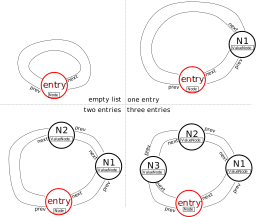

# Ex3.1: Implementation of a bidirectional iterator for a doubly linked list
## Deadline: January 16th 2023, 4pm

This exercise is part one of three parts of Ex3. See also [https://gitlab.tuwien.ac.at/e360251/organization](https://gitlab.tuwien.ac.at/e360251/organization) for an overview and deadlines.

## Structure of files and folders

```
├── CMakeLists.txt
├── include
│   └── List.hpp
├── src
│   ├── CMakeLists.txt
│   └── example.cpp
└── tests
    ├── CMakeLists.txt
    ├── testasserts.hpp    
    ├── TestA_dereference.cpp
    ├── TestB_increment.cpp
    ├── TestC_decrement.cpp
    ├── TestD_decrement_end.cpp
    ├── TestE_member_access.cpp
    ├── TestF_comparisons.cpp
    ├── TestG_loops.cpp
    ├── TestH_const_access.cpp
    └── TestI_stdlib_compatibility.cpp
```

## Task: Extend a provided list implementation with a standard library compatible iterator class

In this exercise you have to implement an standard library compatible, bidirectional iterator for the provided class template `List` in `include/List.hpp`. Let's first have a short introduction on some details.
The provided `List` is a fully functional doubly linked list with a public `push_back` and `push_front` member function (but no further public member functions to insert or erase entries). 
All five special member functions (*rule of 5*) are user-defined and already implemented correctly.
Further, the implementation relies on a *entry node* which is always present (even in a newly constructed empty `List` object) and serves an entry and connets the beginning and end of the list. Let's have a look at the anatomy of the implementation:

```cpp
template <class T> class List {

public:
  using value_type = T;

private:
  struct Node {
    Node *prev;
    Node *next;
  };

  struct ValueNode : Node {
    T value;
  };

  Node *entry;
  size_type size;

  // [...]

public:
  // TODO: implement nested public classes for the iterator here

};
```

**Public nested types:** 

- The public `value_type` alias allows to obtain they type of the elements which are stored in the list.

**Private nested types:** 

- The nested class types `Node` and `ValueNode` are never exposed to the user.
- The `Node` class is the base class and holds two pointers (`prev` `next`) to bidirectionally navigate to the neighbouring nodes in the list.
- The `ValueNode` class inherits from the `Node` class and adds an additional non-reference member `value` to store an element.

**Private members:** 

- The list stores the current size of the list in its data member `size` which is `0` for an empty list.
- The *entry node* `entry` is allocated and initialized when a `List` object is created via one of the constructors of the class; the `prev` and `next` pointer point to itself (this is the state of an empty list).

This already reveals the idea of the *entry node*: it serves as an entry to the list and is always connected to the first and last element (and if no elements are present, it is connected to itself). 
Also note that the *entry node* does not store any value.
The following image illustrates the state of a list in empty state (top left), storing a single element (top right), storing two elements (bottom left), and storing three elements (bottom right).



### Requirements towards the iterator class

To guide you through the requirements towards the iterator several tests are provided:

- **TestA_dereference**: checks if an iterator obtained via `list.begin()` results in a reference to a element stored in the list.
- **TestB_increment** and **TestC_decrement**: checks if the increment `++it` and decrement `--it` results again in an iterator providing access to the expected element.
- **TestD_decrement_end**: checks if an iterator obtained via `list.end()` provides access the last element in a list if it is deceremented once via `--it`.
- **TestE_member_access**: checks if *member-of-pointer* access is possible via the iterator, i.e. if `it->member` provides read and write access to the respective `member` of an element in the list. 
- **TestF_comparisons**: checks if the comparison of iterators is enabled via `!=` and `==` operators
- **TestG_loops**: checks if the iterators work for
  - explicit for loops `for (auto it = list.begin(); it != list.end(); ++it)`
  - range-based for loops `for (const auto& item : list)`
  - while loops `while (it != list.end())`
- **TestH_const_access**: checks if iterators obtained from `List` objects providing `const` access only also provide only `const` access. Additionally `cbegin()` and `cend()` should also only provide const access. Further it is checked if the nested types for the respective iterators `List::iterator` and `List::const_iterator` are available.
- **TestI_stdlib_compatibility**: checks if the bidirectional iterator can be used in the context of functionality and algorithms from the stdlib and provides the expected nested types [cppref](https://en.cppreference.com/w/cpp/iterator/iterator_traits).

## Example

The project also includes a source file `src/example.cpp` which shows some usage of the `List` class and the iterator interface you implemented.

## Building/Running

You can clone, build, and run all tests using:
```
git clone https://gitlab.tuwien.ac.at/e360251/ex3.1.git
cd ex3.1
mkdir build
cd build
cmake .. -D CMAKE_BUILD_TYPE=ASAN
make
ctest --verbose
```

You can build and run each test individually, e.g. using (from the build folder):
```bash
make TestA_dereference 
./test/TestA_dereference 
```

To enable building the example executables run the following commands (in your build folder):
```
cmake .. -D BUILD_EXAMPLE=ON        # enable build of example
cd src
make example
./example 
```
